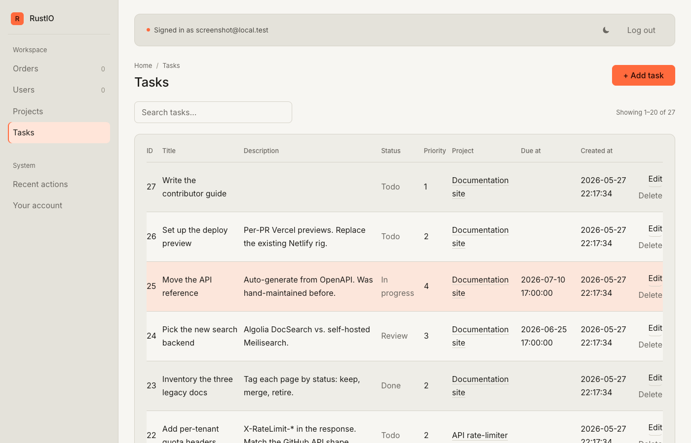
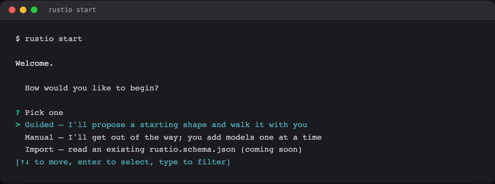
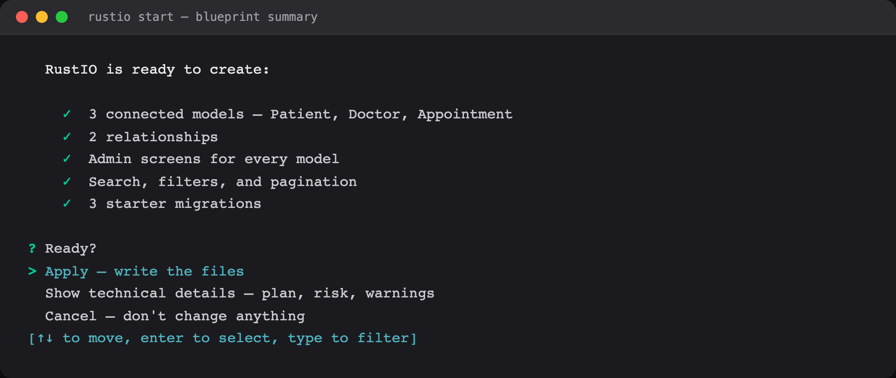
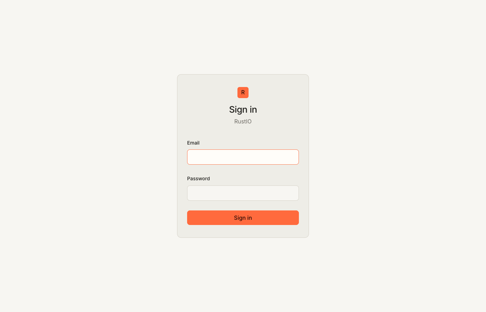
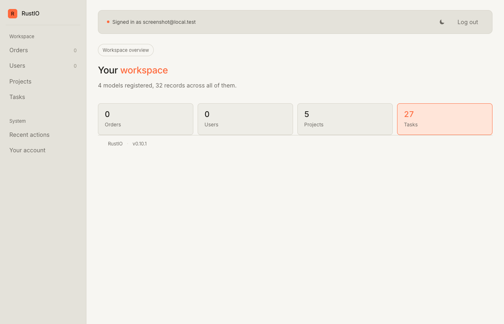
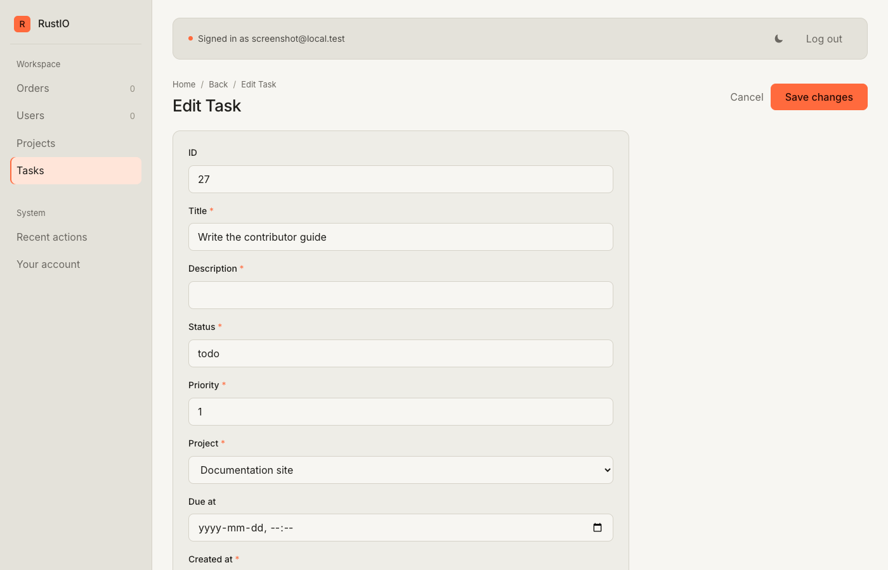

<p align="center">
  <a href="https://crates.io/crates/rustio-cli">
    
  </a>
  <a href="https://docs.rs/rustio-core">
    
  </a>
  <a href="https://github.com/abdulwahed-sweden/rustio/actions/workflows/ci.yml">
    
  </a>
  
  
  
</p>

# RustIO

**Build real web systems in Rust without writing the boring parts.**

You write the data — fields, types, relationships — as plain Rust structs. RustIO gives you back a working admin UI, a database, an auth system, and an HTTP server. Same idea as Django for Python, but built around a strict typed core — so changes to your schema, by hand or via the guided setup, stay safe-by-construction.

If you've never touched Rust before, you should still finish this page in 5 minutes with a running website.



<sub>↑ The taskhub example's `/admin/tasks` page. The `project_id` column displays each project's name (a clickable link), not a raw integer — that's what `#[rustio(belongs_to, display)]` buys you. <a href="examples/taskhub/">→ See the full example</a></sub>

---

## Your first project (5 minutes)

You need [Rust](https://rustup.rs/) installed. Nothing else.

```bash
# 1. Install the CLI
cargo install rustio-cli

# 2. Start a project — this opens the setup menu
rustio init mysite
cd mysite
```

When `init` finishes, RustIO opens a small menu:

<p align="center">
  
</p>

Pick **Guided**, describe what you're building in one sentence (*"a small clinic with patients and appointments"*), and walk each proposed model with a single keystroke. Before any file is written you see a plain-English summary of what's about to happen:

<p align="center">
  
</p>

The technical details (typed plan operations, risk classification, warnings, migration paths) live one keystroke deeper, behind **Show technical details**. You decide what lands. Prefer to do everything by hand? Pick **Manual** and add models one at a time with `rustio new app <name>`.

Finish the loop:

```bash
# 3. Apply the migrations the wizard wrote
rustio migrate apply

# 4. Make a login for yourself
rustio user create --email you@example.com --password secret --role admin

# 5. Start the server
rustio run
```

Open <http://127.0.0.1:8000/admin>, sign in, and you have a working admin for every model you accepted. Click **+ Add …** to create one. Click the row to edit. That's the entire loop.

<p align="center">
  
  
  
</p>

<sub>The three screens you touch most. <b>Left:</b> sign-in. <b>Middle:</b> the dashboard you land on after sign-in — one card per model, live row counts. <b>Right:</b> the edit form RustIO generates from your struct — every field type maps to the right input (foreign keys become <code>&lt;select&gt;</code>s populated from the target table, <code>DateTime</code> becomes a date-time picker, <code>Option&lt;T&gt;</code> fields become nullable).</sub>

> **Stuck?** Run `rustio doctor` from inside the project — it checks every common "why isn't this working" cause and tells you what to fix.

---

## What you just did

| Step | What actually happened |
|---|---|
| `rustio init mysite` | Scaffolded a Rust project with the framework wired up, then opened the setup menu. The Guided path mapped your one-line description to a typed starting shape, walked each model with you, and — for every model you accepted — wrote `apps/<table>/models.rs` plus a `CREATE TABLE` migration. Nothing was guessed: the underlying vocabulary is closed, so requests it can't express are refused rather than approximated. |
| `rustio migrate apply` | Ran the SQL migrations against `app.db` (SQLite, created on first run) and regenerated `rustio.schema.json`. |
| `rustio user create …` | Inserted a row into the `rustio_users` table with an argon2-hashed password and gave it the `admin` role. |
| `rustio run` | Built and ran your binary. The HTTP server listens on `:8000`; `/admin/*` is gated by the auth middleware. |

If any of those words sound unfamiliar, see **[`docs/glossary.md`](docs/glossary.md)** — plain-English definitions of every framework term.

---

## A small mental model

A RustIO project has three places you'll touch most:

- **`apps/<thing>/models.rs`** — the Rust struct that describes one "thing" (a `Note`, a `Customer`, a `Order`). The struct is the source of truth. The admin UI, the database schema, and the JSON schema export are all derived from it.
- **`migrations/*.sql`** — plain SQL files that change the database. Filenames are numbered (`0001_…`, `0002_…`); RustIO applies them in order and remembers which ones it already applied.
- **`main.rs`** — your server entry point. Mostly boilerplate at the start; you'll only edit this when you want to add your own routes outside the admin.

Everything else (the admin UI, the login flow, the session handling, the JSON schema export) is the framework doing work on your behalf.

---

## Want a fuller example?

The repo ships with **[`examples/taskhub/`](examples/taskhub/)** — a real two-model project (Project + Task) with a foreign-key relationship, seed data, and an admin user ready to sign in with. Run it like this:

```bash
cd examples/taskhub
RUSTIO_CORE_PATH="$(pwd)/../../rustio-core" \
  cargo run --manifest-path ../../Cargo.toml -p rustio-cli -- migrate apply
cargo run
# Open http://127.0.0.1:8000/admin
# Sign in: admin@taskhub.local / demo1234
```

The taskhub README walks through every interesting page (FK rendering, RBAC, audit log, the AI pipeline).

---

## Evolving the schema later (advanced)

Once your project is running, the same closed-vocabulary engine that backs the guided setup is available as a three-stage plan/review/apply pipeline for evolving an existing schema:

```bash
rustio ai plan "add date_of_birth as DateTime to notes" --save plan.json
rustio ai review plan.json          # risk, warnings, impact (no execution yet)
rustio ai apply  plan.json --yes    # writes models.rs + a migration
rustio migrate apply                # actually changes the DB
```

The planner expresses changes inside a fixed vocabulary (add field, rename field, add relation, change type, etc.). If your request doesn't fit, it **refuses** rather than guessing. The review step runs deterministic risk classification before anything touches your tree. The executor is atomic — either every file write lands or none of them do.

The whole pipeline reads one file: **`rustio.schema.json`** (generated by `rustio schema`). That's the only contract external tools — including this engine — are allowed to use; nothing else.

---

## CLI cheat sheet

If you forget what something does, type `rustio` with no arguments — the CLI looks at where you are and suggests the most useful next command. Or pass `--why` to any command to get a short explanation without running it.

```bash
rustio                          # context-aware "what should I do next"
rustio help                     # the full command list, grouped by purpose
rustio doctor                   # health check for the current project
rustio explain <topic>          # short docs on `model`, `migration`, `admin`, `ai`, …

rustio init <name>              # new project + opens the setup menu
rustio start                    # open the setup menu inside an existing project
rustio new app <name>           # new model + admin entry + migration stub
rustio migrate apply            # apply pending migrations
rustio migrate status           # what's applied, what's pending
rustio schema                   # regenerate rustio.schema.json
rustio run                      # build + serve on :8000
rustio user create [...]        # add a user (interactive when args missing)

# Advanced — evolve an existing schema through the typed plan pipeline.
rustio ai plan "<change>" [--save PATH]
rustio ai review <plan>
rustio ai apply  <plan> [--yes] [--dry-run] [--force]
```

---

## How fast is it?

Honest numbers, not aspirational:

- **≥ 50,000 req/s** on a simple endpoint
- **10–30 MB** resident memory
- **< 50 ms** cold start
- **~15 MB** stripped release binary

If any release regresses any of these, it doesn't ship.

---

## What RustIO is *not*

- **Not a Django clone.** Different language, different concurrency model, different opinions.
- **Not a generic framework.** Axum, Actix, and Rocket cover that space; RustIO is a higher level.
- **Not a frontend framework.** Server-rendered admin + JSON for everything else.
- **Not a sync framework.** Tokio only.
- **Not an AI toy.** The AI layer is enabled by the typed core; it's not the product on its own.

---

## Going further

- **[`docs/glossary.md`](docs/glossary.md)** — every framework term in plain English.
- **[`docs/advanced/`](docs/advanced/)** — deeper walkthroughs (long-form quickstart, the hospital example, the healthcare stress test). Read these once you're comfortable with the basics.
- **[`docs/design-system.md`](docs/design-system.md)** — what's shipping in the admin today vs the v7 spec in `rustio-core/assets/admin.css`, and the migration path between them.
- **[`ROADMAP.md`](ROADMAP.md)** — the three phases (Foundation / Intelligence / Systems) and where each release fits.
- **[`CHANGELOG.md`](CHANGELOG.md)** — every visible change, version by version.
- **[`CONTRIBUTING.md`](CONTRIBUTING.md)** — how to land a PR.

---

## CLI

See [`docs/cli.md`](docs/cli.md) for the full command reference.

---

## Naming — what about `rustio-admin`?

There's a separate, unrelated project called **[`rustio-admin`](https://github.com/abdulwahed-sweden/rustio-admin)** — a Postgres-first administrative framework. Through its v0.21.x line it shipped a CLI binary also called `rustio`, which meant `cargo install rustio-cli` and `cargo install rustio-admin-cli` silently overwrote each other in `~/.cargo/bin`.

As of [`rustio-admin` v0.22.0](https://github.com/abdulwahed-sweden/rustio-admin/releases/tag/v0.22.0) its binary is named **`rustio-admin`**, so the two no longer collide. You can install both on the same machine and `rustio` always means this project.

The two are different in scope — `rustio-admin` targets Postgres-only admin panels; this project layers an admin UI, ORM, and AI-augmented schema pipeline over a strict typed core with SQLite. Same name prefix, different goals.

---

## Help

Stuck? Open an [issue on GitHub](https://github.com/abdulwahed-sweden/rustio/issues). There are no bad questions — the project is early-alpha and rough edges are real.

License: [MIT](LICENSE).
